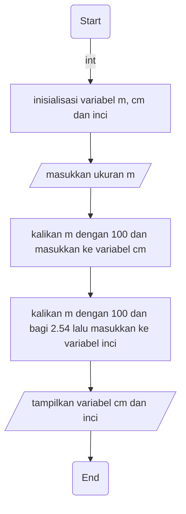

```mermaid
    flowchart TD;
    A(Start) --int--> B[inisialisasi variabel m, cm dan inci];
    B --> C[/masukkan ukuran m/]
    C --> D[kalikan m dengan 100 dan masukkan ke variabel cm];
    D --> E[kalikan m dengan 100 dan bagi 2.54 lalu masukkan ke variabel inci];
    E --> F[/tampilkan variabel cm dan inci/];
    F --> G(End)
```