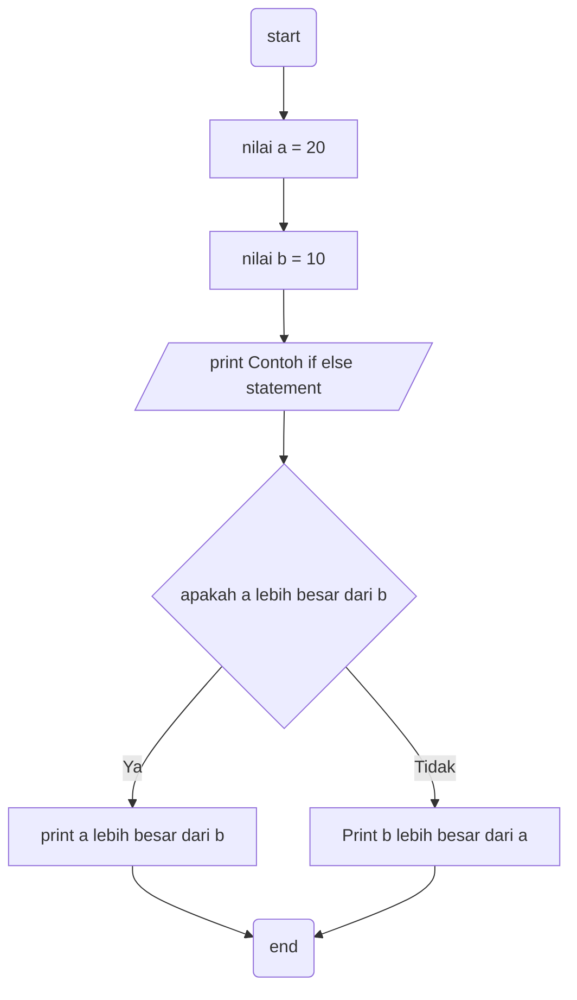

```mermaid
    flowchart TD;
    A(start) --> B[nilai a = 20];
    B --> C[nilai b = 10];
    C --> D[/print Contoh if else statement/]
    D --> E{apakah a lebih besar dari b};
    E --> |Ya| F[print a lebih besar dari b];
    E --> |Tidak| G[Print b lebih besar dari a];
    F & G --> H(end)
```