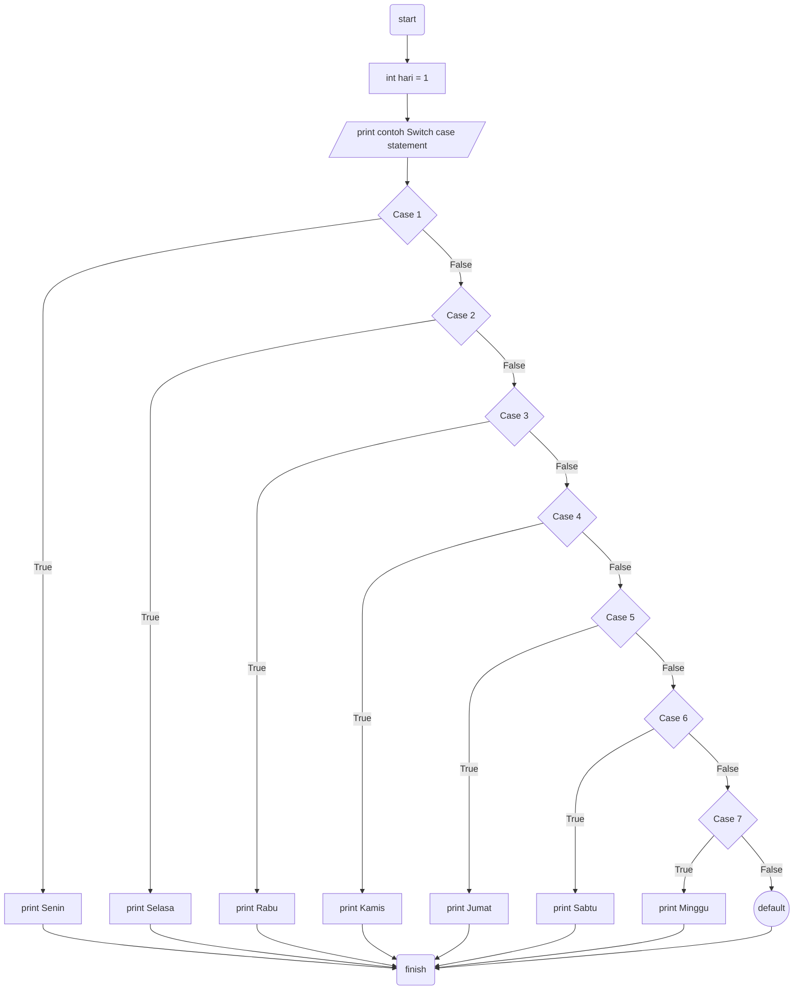

```mermaid
    flowchart TD;
    A(start) --> B[int hari = 1];
    B --> C[/print contoh Switch case statement/];
    C --> D{Case 1}
    D --> |True| E[print Senin];
    D --> |False| F{Case 2};
    F --> |True| G[print Selasa];
    F --> |False| H{Case 3};
    H --> |True| I[print Rabu];
    H --> |False| J{Case 4};
    J --> |True| K[print Kamis];
    J --> |False| L{Case 5};
    L --> |True| M[print Jumat];
    L --> |False| N{Case 6};
    N --> |True| O[print Sabtu];
    N --> |False| P{Case 7};
    P --> |True| Q[print Minggu];
    P --> |False| R((default));
    E & G & I & K & M & O & Q & R --> S(finish)

```