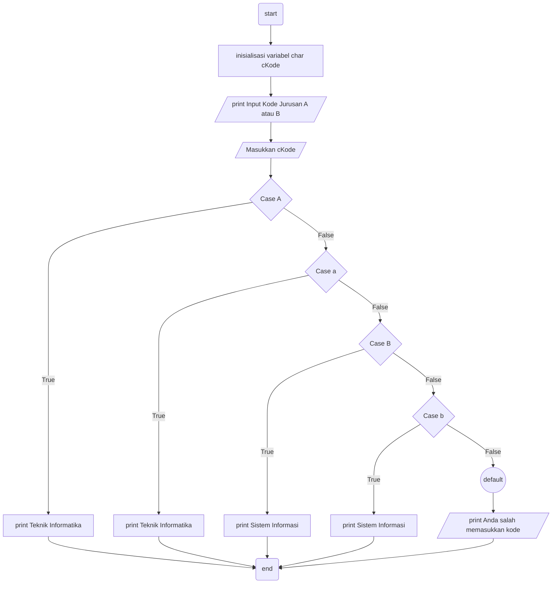

```mermaid
    flowchart TD;
    A(start) --> B[inisialisasi variabel char cKode];
    B --> C[/print Input Kode Jurusan A atau B/];
    C --> D[/Masukkan cKode/]
    D --> E{Case A};
    E --> |True| F[print Teknik Informatika];
    E --> |False| G{Case a};
    G --> |True| H[print Teknik Informatika];
    G --> |False| I{Case B};
    I --> |True| J[print Sistem Informasi];
    I --> |False| K{Case b};
    K --> |True| L[print Sistem Informasi];
    K --> |False| M((default));
    M --> N[/print Anda salah memasukkan kode/];
    F & H & J & L & N --> O(end)
```